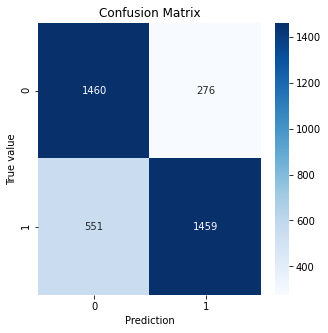
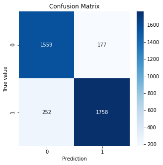
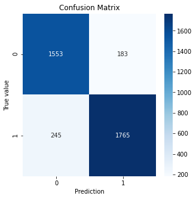

# Sentiment-Analysis-Bot
  A Sentiment Analysis Bot written in python to analyse the sentiment of the given Tweet.
  
  
  I designed an Artificial Intelligence bot using the Sci Kit Learn library's linear regression module on tweet data preprocessed on Positive/Negative, Count Vector &amp; TF-IDF Vectorization. The tokenization &amp; stemming was done by me using Regular Expressions, Emoji, Contractions &amp; NLTK library.  
  
  Pos/Neg Model Accuracy: 77.92% 
  
  
  CV Accuracy: 88.55% 
  
 
  TF-IDF Model Accuracy: 88.57%
  
